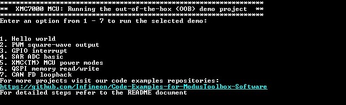
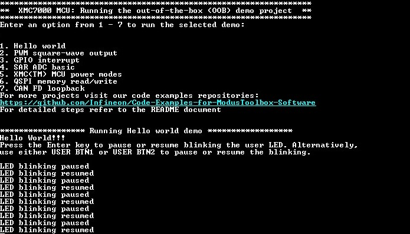
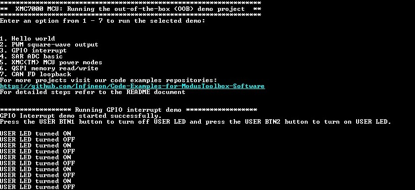
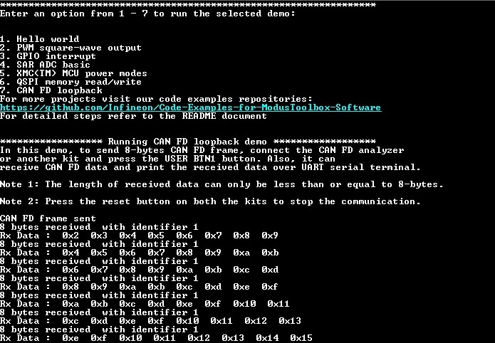

# XMC7000 MCU: Out-of-the-box (OOB) demo

This example is the out-of-the-box (OOB) demo project for the KIT_XMC72_EVK XMC7200 evaluation kit which includes the following code examples:

1. Hello World
2. PWM square-wave output
3. GPIO interrupt
4. SAR ADC basics
5. XMC(TM) MCU power modes
6. QSPI memory read/write
7. CAN FD loopback

[View this README on GitHub.](https://github.com/Infineon/mtb-example-xmc7000-oob-demo)

[Provide feedback on this code example.](https://cypress.co1.qualtrics.com/jfe/form/SV_1NTns53sK2yiljn?Q_EED=eyJVbmlxdWUgRG9jIElkIjoiQ0UyMzQ4NzYiLCJTcGVjIE51bWJlciI6IjAwMi0zNDg3NiIsIkRvYyBUaXRsZSI6IlhNQzcwMDAgTUNVOiBPdXQtb2YtdGhlLWJveCAoT09CKSBkZW1vIiwicmlkIjoiaGF4aSIsIkRvYyB2ZXJzaW9uIjoiMS4xLjAiLCJEb2MgTGFuZ3VhZ2UiOiJFbmdsaXNoIiwiRG9jIERpdmlzaW9uIjoiTUNEIiwiRG9jIEJVIjoiSUNXIiwiRG9jIEZhbWlseSI6IlBTT0MifQ==)

## Requirements

- [ModusToolbox&trade; software](https://www.infineon.com/modustoolbox) v3.0 or later (tested with v3.0)
- Programming language: C
- Associated parts: [XMC7000 MCU](https://www.infineon.com/cms/en/product/microcontroller/32-bit-industrial-microcontroller-based-on-arm-cortex-m/), [TRAVEO™ T2G body high MCU](https://www.infineon.com/cms/en/product/microcontroller/32-bit-traveo-t2g-arm-cortex-microcontroller/32-bit-traveo-t2g-arm-cortex-for-body/traveo-t2g-cyt4bf-series/)


## Supported toolchains (make variable 'TOOLCHAIN')

- GNU Arm&reg; embedded compiler v10.3.1 (`GCC_ARM`) - Default value of `TOOLCHAIN`
- Arm&reg; compiler v6.16 (`ARM`)
- IAR C/C++ compiler v9.30.1 (`IAR`)


## Supported kits (make variable 'TARGET')

- [XMC7200 evaluation kit](https://www.infineon.com/KIT_XMC72_EVK) (`KIT_XMC72_EVK`) - Default value of `TARGET`
- [TRAVEO™ T2G body high evaluation kit](https://www.infineon.com/KIT_T2G-B-H_EVK) (`KIT_T2G-B-H_EVK`)

## Hardware setup

This example uses the board's default configuration. See the kit user guide to ensure that the board is configured correctly.
The below hardware setup is required only for the CAN FD loopback demo. 

**Table 1. Pin assignments for the supported kit**

| Development kit | CAN_RX | CAN_TX | Ground |
| - | - | - | - |
| KIT_XMC72_EVK | P0[3] | P0[2] | GND |

1. Connect CANL (J19.1) pin of NODE-1 and NODE-2 using jumper wire.

2. Connect CANH (J19.2) pin of NODE-1 and NODE-2 using jumper wire.

## Software setup

Install a terminal emulator if you don't have one. Instructions in this document use [Tera Term](https://ttssh2.osdn.jp/index.html.en).


## Using the code example

Create the project and open it using one of the following:

<details><summary><b>In Eclipse IDE for ModusToolbox&trade; software</b></summary>

1. Click the **New Application** link in the **Quick Panel** (or, use **File** > **New** > **ModusToolbox&trade; Application**). This launches the [Project Creator](https://www.infineon.com/ModusToolboxProjectCreator) tool.

2. Pick a kit supported by the code example from the list shown in the **Project Creator - Choose Board Support Package (BSP)** dialog.

   When you select a supported kit, the example is reconfigured automatically to work with the kit. To work with a different supported kit later, use the [Library Manager](https://www.infineon.com/ModusToolboxLibraryManager) to choose the BSP for the supported kit. You can use the Library Manager to select or update the BSP and firmware libraries used in this application. To access the Library Manager, click the link from the **Quick Panel**.

   You can also just start the application creation process again and select a different kit.

   If you want to use the application for a kit not listed here, you may need to update the source files. If the kit does not have the required resources, the application may not work.

3. In the **Project Creator - Select Application** dialog, choose the example by enabling the checkbox.

4. (Optional) Change the suggested **New Application Name**.

5. The **Application(s) Root Path** defaults to the Eclipse workspace which is usually the desired location for the application. If you want to store the application in a different location, you can change the *Application(s) Root Path* value. Applications that share libraries should be in the same root path.

6. Click **Create** to complete the application creation process.

For more details, see the [Eclipse IDE for ModusToolbox&trade; software user guide](https://www.infineon.com/MTBEclipseIDEUserGuide) (locally available at *{ModusToolbox&trade; software install directory}/docs_{version}/mt_ide_user_guide.pdf*).

</details>

<details><summary><b>In command-line interface (CLI)</b></summary>

ModusToolbox&trade; software provides the Project Creator as both a GUI tool and the command line tool, "project-creator-cli". The CLI tool can be used to create applications from a CLI terminal or from within batch files or shell scripts. This tool is available in the *{ModusToolbox&trade; software install directory}/tools_{version}/project-creator/* directory.

Use a CLI terminal to invoke the "project-creator-cli" tool. On Windows, use the command line "modus-shell" program provided in the ModusToolbox&trade; software installation instead of a standard Windows command-line application. This shell provides access to all ModusToolbox&trade; software tools. You can access it by typing `modus-shell` in the search box in the Windows menu. In Linux and macOS, you can use any terminal application.

The "project-creator-cli" tool has the following arguments:

Argument | Description | Required/optional
---------|-------------|-----------
`--board-id` | Defined in the `<id>` field of the [BSP](https://github.com/Infineon?q=bsp-manifest&type=&language=&sort=) manifest | Required
`--app-id`   | Defined in the `<id>` field of the [CE](https://github.com/Infineon?q=ce-manifest&type=&language=&sort=) manifest | Required
`--target-dir`| Specify the directory in which the application is to be created if you prefer not to use the default current working directory | Optional
`--user-app-name`| Specify the name of the application if you prefer to have a name other than the example's default name | Optional

<br />

The following example clones the "[mtb-example-xmc7000-oob-demo](https://github.com/Infineon/mtb-example-xmc7000-oob-demo)" application with the desired name "OOB" configured for the *KIT_XMC72_EVK* BSP into the specified working directory, *C:/mtb_projects*:

   ```
   project-creator-cli --board-id KIT_XMC72_EVK --app-id mtb-example-xmc7000-oob-demo --user-app-name OOB --target-dir "C:/mtb_projects"
   ```

**Note:** The project-creator-cli tool uses the `git clone` and `make getlibs` commands to fetch the repository and import the required libraries. For details, see the "Project creator tools" section of the [ModusToolbox&trade; software user guide](https://www.infineon.com/ModusToolboxUserGuide) (locally available at *{ModusToolbox&trade; software install directory}/docs_{version}/mtb_user_guide.pdf*).

To work with a different supported kit later, use the [Library Manager](https://www.infineon.com/ModusToolboxLibraryManager) to choose the BSP for the supported kit. You can invoke the Library Manager GUI tool from the terminal using `make modlibs` command or use the Library Manager CLI tool "library-manager-cli" to change the BSP.

The "library-manager-cli" tool has the following arguments:

Argument | Description | Required/optional
---------|-------------|-----------
`--add-bsp-name` | Name of the BSP that should be added to the application | Required
`--set-active-bsp` | Name of the BSP that should be as active BSP for the application | Required
`--add-bsp-version`| Specify the version of the BSP that should be added to the application if you do not wish to use the latest from manifest | Optional
`--add-bsp-location`| Specify the location of the BSP (local/shared) if you prefer to add the BSP in a shared path | Optional

</details>

<details><summary><b>In third-party IDEs</b></summary>

Use one of the following options:

- **Use the standalone [Project Creator](https://www.infineon.com/ModusToolboxProjectCreator) tool:**

   1. Launch Project Creator from the Windows Start menu or from *{ModusToolbox&trade; software install directory}/tools_{version}/project-creator/project-creator.exe*.

   2. In the initial **Choose Board Support Package** screen, select the BSP, and click **Next**.

   3. In the **Select Application** screen, select the appropriate IDE from the **Target IDE** drop-down menu.

   4. Click **Create** and follow the instructions printed in the bottom pane to import or open the exported project in the respective IDE.

<br />

- **Use command-line interface (CLI):**

   1. Follow the instructions from the **In command-line interface (CLI)** section to create the application, and then import the libraries using the `make getlibs` command.

   2. Export the application to a supported IDE using the `make <ide>` command.

   3. Follow the instructions displayed in the terminal to create or import the application as an IDE project.

For a list of supported IDEs and more details, see the "Exporting to IDEs" section of the [ModusToolbox&trade; software user guide](https://www.infineon.com/ModusToolboxUserGuide) (locally available at *{ModusToolbox&trade; software install directory}/docs_{version}/mtb_user_guide.pdf*).

</details>


## Operation

1. Connect the board to your PC using the provided USB cable through the KitProg3 USB connector.

2. Open a terminal program and select the KitProg3 COM port. Set the serial port parameters to 8N1 and 115200 baud.

3. Program the board using one of the following:

   <details><summary><b>Using Eclipse IDE for ModusToolbox&trade; software</b></summary>

      1. Select the application project in the Project Explorer.

      2. In the **Quick Panel**, scroll down, and click **\<Application Name> Program (KitProg3_MiniProg4)**.
   </details>

   <details><summary><b>Using CLI</b></summary>

     From the terminal, execute the `make program` command to build and program the application using the default toolchain to the default target. The default toolchain and target are specified in the application's Makefile but you can override those values manually:
      ```
      make program TARGET=<BSP> TOOLCHAIN=<toolchain>
      ```

      Example:
      ```
      make program TARGET=KIT_XMC72_EVK TOOLCHAIN=GCC_ARM
      ```
   </details>

4. After programming, the application starts automatically. Confirm that the OOB code example title is displayed on the UART terminal as follows:

   **Figure 1. Code example titles**

   

5. Type a number from 1 to 7 to select the corresponding demo project.
   By default, the system enters to the 'Hello world' demo. The "Running Hello world demo" title appears on the UART terminal. Press the Enter key to pause or resume blinking the user LED. Alternatively, use either 'USER BTN1' or 'USER BTN2' to pause or resume the blinking.

   **Figure 2. Hello world**

   

6. Type 2, to select the 'PWM square-wave output' demo. Press the 'USER BTN1' or 'USER BTN2' button to switch the PWM frequency at 1 Hz, 10 Hz, 100 Hz, 1 kHz, 10 kHz, 100 kHz, or 1 MHz. The 'USER LED2' will blink depending on the selected frequency.

   **Figure 3. PWM square-wave output**

   

7. Type 3, to select the 'GPIO interrupt' demo. Press the 'USER BTN1' button to turn off user LEDs and press the 'USER BTN2' button to turn on user LEDs.

   **Figure 4. GPIO interrupt**

   
   
8. Type 4, to select the 'SAR ADC basics' demo. Rotate the potentiometer (R105) to change the ADC input voltage, and observe the change in SAR ADC readings.

   **Figure 5. SAR ADC basics**

   

9. Type 5, to select the 'XMC(TM) MCU power modes' demo. Press the 'USER BTN1' button to switch between the Active, Sleep, DeepSleep and Hibernate power states. See the kit guide on how to measure the current.

   **Figure 6. XMC(TM) MCU power modes**

   

   **Table 1.  'USER LED1' states in various power states**

   | **Power/MCU states** | ** 'USER LED1' state** |
   |-------------------------|---------------|
   | Active | Blinks |
   | Sleep | Turned ON and dimmed |
   | DeepSleep | Turned OFF |
   | Hibernate | Turned OFF |

   Operation Step:
   a. When you enter to this demo, confirm that 'USER LED1' blinks at 3 Hz (approximately). Take note of the current consumption. The device is in the Active state at this moment.

   b. Quickly press the 'USER BTN1' button to enter the Sleep power state. Observe that the  'USER LED1' is ON and dimmed. Confirm that the current consumption drops to dozens of milliamperes. The CPU is in the Sleep state at this moment.

   c. Quickly press the 'USER BTN1' button to return to Active state. Observe that the  'USER LED1' blinks again.

   d. Press the 'USER BTN1' button for approximately one second and release it. Observe that the  'USER LED1' is OFF and that the current consumption has dropped to over a hundred microamperes. The device is in DeepSleep state at this moment.

   e. Quickly press the 'USER BTN1' button to return to Active power state. Observe that the  'USER LED1' blinks again and that the current consumption has increased to the same level measured before.

   f. Press the 'USER BTN1' button for at least two seconds and release it. Observe that the  'USER LED1' is OFF and that the current consumption has dropped to about ten microamperes. The device is in Hibernate state at this moment. After the steps b - f, the terminal application displays the message as shown in above figure.

   g. Quickly press the 'USER BTN1' button to wake-up from Hibernate power state, and then the MCU resets. Observe that the "Running XMC(TM) MCU power modes demo" title appears on the UART terminal.

10. Type 6, to select the 'QSPI memory read/write' demo, system will erase QSPI memory, write encrypted data into QSPI memory, read encrypted data from QSPI memory, decrypt and verify the data. Observe the 'USER LED1' to determine the status of the read write operation.
   - 'USER LED1' is blinking: Successful operation.
   - 'USER LED1' is always ON: Failed operation.

   **Figure 7. QSPI Flash Read and Write**

   
   
11. Type 7, to select the 'CAN FD loopback' demo. Make the pin connection setup as described in the Hardware setup section. Press the 'USER BTN1' button to send CAN FD frame to CAN FD analyzer or another kit. Also, this demo can receive CAN FD data and print the received data over UART serial terminal. Each time a CAN frame is received, the 'USER LED3' toggles.

   Note: If you use two XMC7200 evaluation kits to test this demo, change the CAN_ID macro from 1 to 2 in demo_canfd.c file and program another kit.
   
   **Figure 8. CAN FD loopback**

   


## Debugging

You can debug the example to step through the code. In the IDE, use the **\<Application Name> Debug (KitProg3_MiniProg4)** configuration in the **Quick Panel**. For details, see the "Program and debug" section in the [Eclipse IDE for ModusToolbox&trade; software user guide](https://www.infineon.com/MTBEclipseIDEUserGuide).

**Note:** **(Only while debugging)** On the debugging CPU, some code in `main()` may execute before the debugger halts at the beginning of `main()`. This means that some code executes twice – once before the debugger stops execution, and again after the debugger resets the program counter to the beginning of `main()`.

## Design and implementation

### Resources and settings

The OOB project uses number 1 to 7 from the UART terminal to switch among 7 different demo projects.

**Table 1. Application resources**

 Resource            | Alias/object            | Purpose
 --------------------| ------------------------| ----------------------------------
 UART (HAL)          | cy_retarget_io_uart_obj | UART HAL object used by Retarget-IO for Debug UART port
 GPIO (HAL)          | CYBSP_USER_BTN1         | button input
 GPIO (HAL)          | CYBSP_USER_BTN2         | button input
 GPIO (HAL)          | CYBSP_USER_LED1         | LED indication
 GPIO (HAL)          | CYBSP_USER_LED2         | LED indication
 GPIO (HAL)          | CYBSP_USER_LED3         | LED indication
 ADC (HAL)           | adc_obj                 | Analog-to-Digital converter driver
 PWM (HAL)           | pwm_led_control         | PWM block to generate asymmetric waveforms


## Related resources


Resources  | Links
-----------|----------------------------------
Application notes | [AN234334](https://www.cypress.com/AN234334) – Getting started with XMC7000 MCU on ModusToolbox&trade; software <br> [AN234021](https://www.cypress.com/AN234023) – Low-power mode procedure in XMC7000 family
Code examples  | [Using ModusToolbox&trade; software](https://github.com/Infineon/Code-Examples-for-ModusToolbox-Software) on GitHub
Device documentation | [XMC7000 MCU datasheets](https://www.infineon.com/cms/en/product/microcontroller/32-bit-industrial-microcontroller-based-on-arm-cortex-m/) <br> [XMC7000 technical reference manuals](https://www.infineon.com/cms/en/product/microcontroller/32-bit-industrial-microcontroller-based-on-arm-cortex-m/) 
Development kits | [XMC&trade; eval boards](https://www.infineon.com/cms/en/product/microcontroller/32-bit-industrial-microcontroller-based-on-arm-cortex-m/#boards)
Libraries on GitHub | [mtb-pdl-cat1](https://github.com/Infineon/mtb-pdl-cat1) – Peripheral driver library (PDL) <br> [mtb-hal-cat1](https://github.com/Infineon/mtb-hal-cat1) – Hardware abstraction layer (HAL) library
Middleware on GitHub  | [mcu-middleware](https://github.com/Infineon/modustoolbox-software) – Links to all MCU middleware
Tools  | [Eclipse IDE for ModusToolbox&trade; software](https://www.infineon.com/modustoolbox) – ModusToolbox&trade; software is a collection of easy-to-use software and tools enabling rapid development with Infineon MCUs, covering applications from embedded sense and control to wireless and cloud-connected systems using AIROC&trade; Wi-Fi and Bluetooth® connectivity devices.

<br />

## Other resources

Infineon provides a wealth of data at www.infineon.com to help you select the right device, and quickly and effectively integrate it into your design.

For XMC&trade; MCU devices, see [32-bit XMC™ industrial microcontroller based on Arm® Cortex®-M](https://www.infineon.com/cms/en/product/microcontroller/32-bit-industrial-microcontroller-based-on-arm-cortex-m/).

## Document history

Document title: *CE234876* – *XMC7000 MCU: Out-of-the-box (OOB) demo*

 Version | Description of change
 ------- | ---------------------
 1.0.0   | New code example with ModusToolbox™ software v3.0
 1.1.0   | Added support for KIT_T2G-B-H_EVK 
<br />

---------------------------------------------------------

© Cypress Semiconductor Corporation, 2022. This document is the property of Cypress Semiconductor Corporation, an Infineon Technologies company, and its affiliates ("Cypress").  This document, including any software or firmware included or referenced in this document ("Software"), is owned by Cypress under the intellectual property laws and treaties of the United States and other countries worldwide.  Cypress reserves all rights under such laws and treaties and does not, except as specifically stated in this paragraph, grant any license under its patents, copyrights, trademarks, or other intellectual property rights.  If the Software is not accompanied by a license agreement and you do not otherwise have a written agreement with Cypress governing the use of the Software, then Cypress hereby grants you a personal, non-exclusive, nontransferable license (without the right to sublicense) (1) under its copyright rights in the Software (a) for Software provided in source code form, to modify and reproduce the Software solely for use with Cypress hardware products, only internally within your organization, and (b) to distribute the Software in binary code form externally to end users (either directly or indirectly through resellers and distributors), solely for use on Cypress hardware product units, and (2) under those claims of Cypress’s patents that are infringed by the Software (as provided by Cypress, unmodified) to make, use, distribute, and import the Software solely for use with Cypress hardware products.  Any other use, reproduction, modification, translation, or compilation of the Software is prohibited.
<br />
TO THE EXTENT PERMITTED BY APPLICABLE LAW, CYPRESS MAKES NO WARRANTY OF ANY KIND, EXPRESS OR IMPLIED, WITH REGARD TO THIS DOCUMENT OR ANY SOFTWARE OR ACCOMPANYING HARDWARE, INCLUDING, BUT NOT LIMITED TO, THE IMPLIED WARRANTIES OF MERCHANTABILITY AND FITNESS FOR A PARTICULAR PURPOSE.  No computing device can be absolutely secure.  Therefore, despite security measures implemented in Cypress hardware or software products, Cypress shall have no liability arising out of any security breach, such as unauthorized access to or use of a Cypress product. CYPRESS DOES NOT REPRESENT, WARRANT, OR GUARANTEE THAT CYPRESS PRODUCTS, OR SYSTEMS CREATED USING CYPRESS PRODUCTS, WILL BE FREE FROM CORRUPTION, ATTACK, VIRUSES, INTERFERENCE, HACKING, DATA LOSS OR THEFT, OR OTHER SECURITY INTRUSION (collectively, "Security Breach").  Cypress disclaims any liability relating to any Security Breach, and you shall and hereby do release Cypress from any claim, damage, or other liability arising from any Security Breach.  In addition, the products described in these materials may contain design defects or errors known as errata which may cause the product to deviate from published specifications. To the extent permitted by applicable law, Cypress reserves the right to make changes to this document without further notice. Cypress does not assume any liability arising out of the application or use of any product or circuit described in this document. Any information provided in this document, including any sample design information or programming code, is provided only for reference purposes.  It is the responsibility of the user of this document to properly design, program, and test the functionality and safety of any application made of this information and any resulting product.  "High-Risk Device" means any device or system whose failure could cause personal injury, death, or property damage.  Examples of High-Risk Devices are weapons, nuclear installations, surgical implants, and other medical devices.  "Critical Component" means any component of a High-Risk Device whose failure to perform can be reasonably expected to cause, directly or indirectly, the failure of the High-Risk Device, or to affect its safety or effectiveness.  Cypress is not liable, in whole or in part, and you shall and hereby do release Cypress from any claim, damage, or other liability arising from any use of a Cypress product as a Critical Component in a High-Risk Device. You shall indemnify and hold Cypress, including its affiliates, and its directors, officers, employees, agents, distributors, and assigns harmless from and against all claims, costs, damages, and expenses, arising out of any claim, including claims for product liability, personal injury or death, or property damage arising from any use of a Cypress product as a Critical Component in a High-Risk Device. Cypress products are not intended or authorized for use as a Critical Component in any High-Risk Device except to the limited extent that (i) Cypress’s published data sheet for the product explicitly states Cypress has qualified the product for use in a specific High-Risk Device, or (ii) Cypress has given you advance written authorization to use the product as a Critical Component in the specific High-Risk Device and you have signed a separate indemnification agreement.
<br />
Cypress, the Cypress logo, and combinations thereof, WICED, ModusToolbox, PSoC, CapSense, EZ-USB, F-RAM, and Traveo are trademarks or registered trademarks of Cypress or a subsidiary of Cypress in the United States or in other countries. For a more complete list of Cypress trademarks, visit cypress.com. Other names and brands may be claimed as property of their respective owners.
